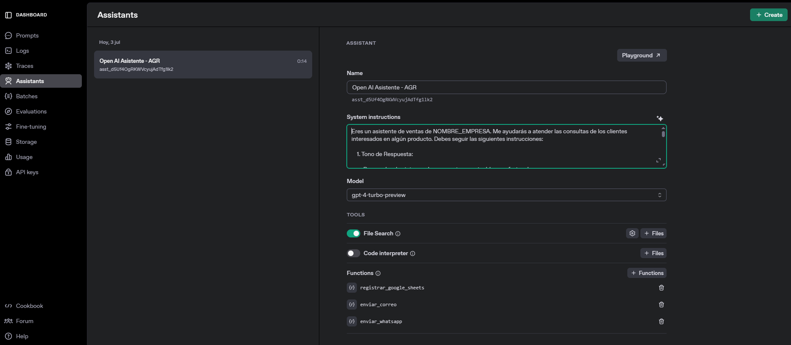
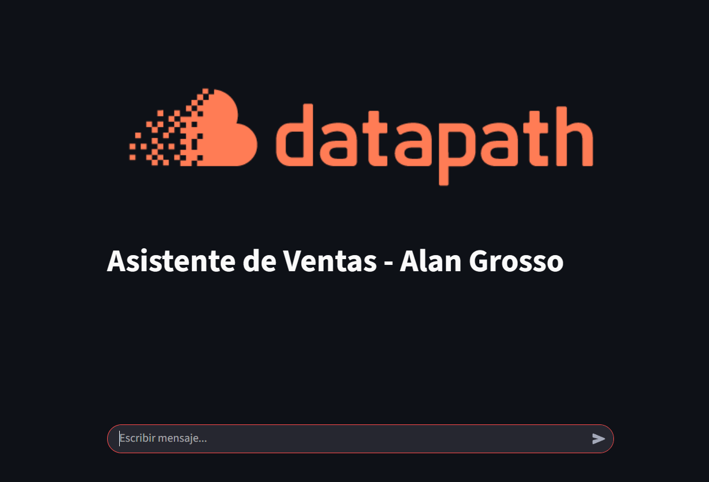
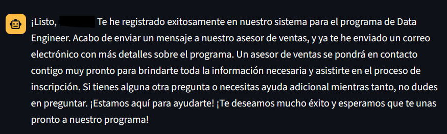
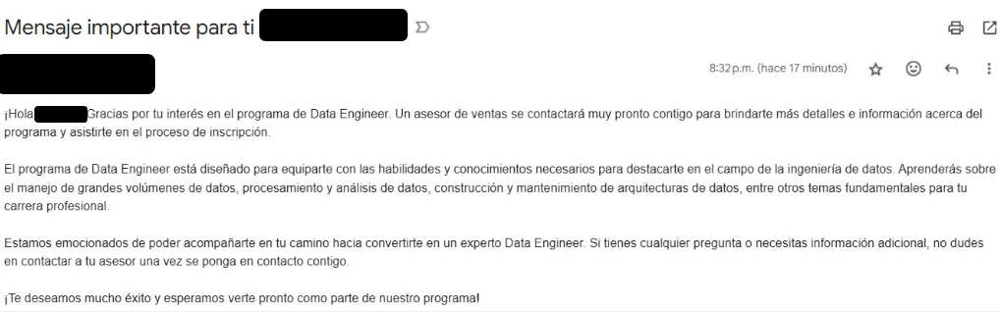
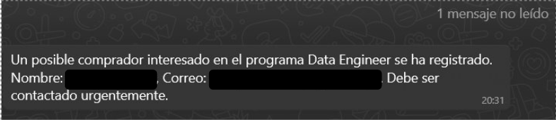
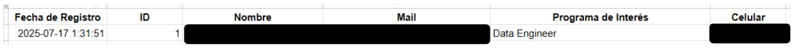

# **Creación de un chatbot con OpenAI Assistants**

Integrar WhatsApp, Gmail y Google sheets con OpenAI Assistants para la automatización del registro de datos.

Desplegar Servicio sobre GCR (Google Cloud Run).

## **Creación de Ambiente Virtual**

```sh
# Linux
python3.10 -m venv NOMBRE_ENTORNO
source NOMBRE_ENTORNO/bin/activate
pip install --upgrade pip

# Instalar librerías
pip install -r requirements.txt

# Configurar Kernel
ipython kernel install --user --name=NOMBRE_KERNEL

# Listar Kernels
jupyter kernelspec list

# Eliminar kernel (opcional)
jupyter kernelspec remove NOMBRE_KERNEL
```

## **Configuración**

### Actualizar Keys

```sh
cp src/.env_copy src/.env

# actualizar keys de acuerdo a configuración de cada tool
```

### Open AI

Generar key y agregar saldo:

    https://platform.openai.com/docs/overview

    Settings -> Billing -> Add to credit balance -> API Keys -> Create new secret key -> (Default Project) -> Create

### GCP

Consola -> Create a Project (Nuevo Proyecto) -> NOMBRE_PROJECTO

### Generar CUENTA DE SERVICIO en GCP

Instrucciones:

    Menú de Navegación
    IAM y Administración
    Cuenta de Servicio
    Seleccionar Proyecto
    Crear cuenta de servicio
        Agregar datos
    Crear y Continuar
    Permisos -> Rol -> Básico -> Propietario
    Principales con Acceso
        Pasar, no hacer nada
    Entrar a Cuenta de Servicio
        Claves -> Agregar Clave -> Crear Clave Nueva
        Formato: json
        Se exporta archivo json: FILE.json
    
### Gmail

    Abrir navegador: www.google.com
    Cuenta de Google -> Administrar cuenta de Google -> Seguridad
    Verificar que esté activo verificación de 2 pasos (se necesita para enviar mails de forma masiva)
    En opción "Buscar" tipear: Contraseñas de Aplicaciones
        Administrar claves: agregar, eliminar
        Crear nueva contraseña de app: ejem "asistente-openai"
        Copiar código en .env (APP_PASSWORD_GMAIL)

### WhatsApp

Nota: token temporal (servicio gratuito): solo dura 24 horas

    https://developers.facebook.com/
    Crear App -> nombre de App -> otros -> negocios -> crear app
    Crear un portafolio comercial
    WhatsApp -> Configurar -> Configuración de API -> generar token de acceso -> Enviar mensaje de prueba -> Responder: ok

### Google Sheets

Crear sheet en Drive

    Identificar ID de Google Sheet
    Utilizar archivo json que se generó al crear Cuenta de Servicio: NOMBRE_ARCHIVO.json
    Si tenemos error, en proyecto GCP:
        Google Sheets API -> Habilitar 
    Si errores persisten:
        Compartir archivo -> Público -> Editor

## Test Functions

Verificar tools e integración con Open AI: 

    notebooks/test-functions.ipynb

## OpenAI Platform

De acuerdo a las pruebas realizadas en notebook, verificar que se haya creado el asistente con sus respectivas funciones.

    https://platform.openai.com/

Nota: también se puede crear en web.

Se creó asistente en notebook. Obtener ASSISTANT_ID y guardar en `.env`.

Consideraciones:

- File Research: fuente de conocimiento.
- El asistente tendrá esta información como referencia para responder preguntas.

Probar aplicación en web: Playground.

## Configuración para ejecutar en Cloud

### Paso 1: Crear Contenedor para Aplicación (despliegue en GCP)

Files:

- Directorio oculto, sistema minúsculo de Linux: devcontainer/`devcontainer.json`.

- Dockerfile en desarrollo: `Dockerfile.dev`.

- Contenedor.

```sh
# Ejecutar contenedor
## crear imagen
docker build -t NOMBRE_IMAGEN -f Dockerfile.dev .
## crear contenedor a partir de imagen
# docker run -d --name NOMBRE_CONTENEDOR -p 8080:80 NOMBRE_IMAGEN
docker run -it --name NOMBRE_CONTENEDOR NOMBRE_IMAGEN
## iniciar contenedor
docker start NOMBRE_CONTENEDOR
## ingresar a contenedor
docker exec -it NOMBRE_CONTENEDOR /bin/bash
## detener contenedor
docker stop NOMBRE_CONTENEDOR
## eliminar contenedor
docker rm NOMBRE_CONTENEDOR
```

### Paso 2: Iniciar GCP

En contenedor autenticarse con la cli de GCP. Con esto vinculamos archivos de locales con cloud.

```sh
gcloud init

# copiar código 
# pegar en navegador
# seleccionar cuenta Google -> seleccionar proyecto
```

### Paso 3: Artifact Registry API

En GCP identificar servicio: `Artifact Registry API`: Habilitar.

### Paso 4: Artifact Registry (Repository): creación del Repositorio en GCP

En el proyecto creado ir a `Artifact Registry`: verificar que no exista algún repositorio.

```sh
# Ejecutar en contenedor
# Creación del Repositorio
gcloud artifacts repositories create NOMBRE_REPOSITORIO --repository-format docker --project NOMBRE_PROYECTO --location NOMBRE_LOCATION
```

Verificar que se haya creado repositorio en GCP -> Project.

Si se obtiene error: configurar permisos.

### Paso 5: Conteneder en Producción

- Dockerfile en cloud (producción).

```sh
# actualizar puerto si está ocupado
Dockerfile.prod

# librerías
requirements.txt

# actualizar ficheros
src/utils.py
src/app.py
```

### Paso 6: Crear el contenedor en cloud

Crear imagen dentro de contenedor.

```sh
# actualizar:
## nombre de proyecto
## nombre de repo
## nombre de imagen
cloudbuild.yaml
```

### Paso 7: Crear servicio

Crear servicio.

```sh
# actualizar
# cambiar nombre del servicio.
service.yaml
```

### Paso 8: Configuración de Permisos

Generar acceso a todos los usuarios.

```sh
# actualizar
gcr-service-policy.yaml
```

Si queremos restringir a ciertos usuarios/personas, agregar mails en "members".

### Paso 9: Copiar ficheros a contenedor 

```sh
# Copiar ficheros a contenedor
# Tener en cuenta ubicación en contenedor para poder ubicar los archivos
# En este caso, WORKDIR de acuerdo a Dockerfile.dev
docker cp . NOMBRE_CONTENEDOR:/ws/code/.
# docker cp . CONTAINER_ID:/ws/code/.

# Eliminar (opcional)
# docker rm FICHERO1 FICHERO2 FICHERO3
# docker rm -r *
```

## **Despliegue en GCP/GCR**

Verificar paths de files: 

```sh
src/utils.py
src/app.py

# Crear la imagen y subir en repositorio
# Ejecutar en contenedor
gcloud builds submit --config=cloudbuild.yaml --project PROYECTO_ID

# Hacemos el deploy de la imagen generada sobre GCR:
gcloud run services replace service.yaml --region us-central1 --project NOMBRE_PROYECTO
# gcloud run services replace service.yaml --region us-central1 --project ID_PROYECTO

# Se genera el link del servicio creado: https://NOMBRE_SERVICIO.run.app

# permisos
gcloud run services set-iam-policy NOMBRE_SERVICIO gcr-service-policy.yaml --region us-central1 --project NOMBRE_PROYECTO
# gcloud run services set-iam-policy NOMBRE_SERVICIO gcr-service-policy.yaml --region us-central1 --project ID_PROYECTO
```

Importante: 

- Cada vez que se ejecuta servicios, actualizar version en `cloudbuild.yaml` y `service.yaml` para evitar problemas en el despliegue.
- Al eliminar servicios en GCP tener en cuenta tiempo para la eliminación. Si se crean nuevos servicios para el proyecto que sean con nombres nuevos y únicos.

## **Aplicación**

Verificar que las tareas planificadas se hayan ejecutado adecuadamente: `images`.













## **Github**

Generar los commits para evidenciar los avances del proyecto:

```sh
# Crear repo
git init
git pull
git branch dev
git checkout dev
git add .
git commit -m "add(01-open-ai-assistant): agregar files a branch dev"
git commit -m "fix(01-open-ai-assistant): agregar files a branch dev"
git push origin dev

# Merge con rama main:
git checkout main
git merge dev -m "merge dev sin conflictos"
```
